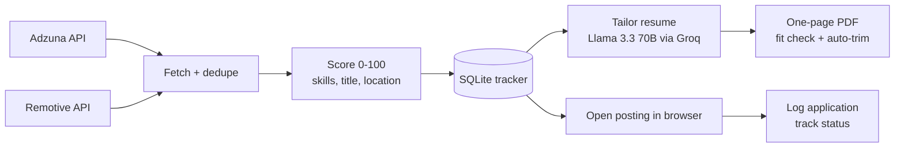

# Job Hunter


A command-line tool that finds job postings through **official job APIs**, scores each one
against your skills, and uses an LLM to **tailor your resume into a one-page, ATS-friendly PDF**.
It tracks every job and application in a local database.

You stay in control of applying: Job Hunter opens the posting in your browser and you submit
the application yourself. It never logs in to job boards, scrapes them, or applies for you.

## How it works



| Stage | What it does |
|---|---|
| **Fetch** | Queries [Adzuna](https://developer.adzuna.com/) (aggregates many job boards and company sites) and [Remotive](https://remotive.com/) (remote jobs). Removes duplicates of the same title + company across sources and across runs. |
| **Score** | 0–100 per job: keyword match with your weighted skills (50), title match with your target roles (30), preferred location (20). Jobs below `min_score` are skipped. |
| **Tailor** | Sends your base resume and the job description to Llama 3.3 70B with rules: match keywords and reorder, but **never invent** experience; keep every item in your `must_keep` list. |
| **Fit to one page** | Renders the PDF and measures how full the page is. If it overflows, it removes one wrapped line at a time from the bullet that loses the fewest words. If it's under 85% full, it asks the LLM for more detail. |
| **Track** | Stores jobs and applications in SQLite; update status as you hear back (interview, offer, rejected...). |

## Setup

Requires Python 3.11+.

```bash
git clone https://github.com/srikanthmannepalli0502-cmyk/job-hunter-auto.git
cd job-hunter-auto
python -m venv .venv
.venv\Scripts\activate          # Windows
# source .venv/bin/activate     # macOS / Linux
pip install -r requirements.txt
```

1. **API keys:** copy `.env.example` to `.env` and add:
   - `GROQ_API_KEY`: free at https://console.groq.com/keys
   - `ADZUNA_APP_ID` / `ADZUNA_APP_KEY`: free at https://developer.adzuna.com/
     (Remotive needs no key.)
2. **Profile:** copy `profile.example.toml` to `profile.toml` and set your search, skill weights,
   target titles and `must_keep` items (project and certification names).
3. **Resume:** put your base resume at `resumes/base_resume.pdf` (or `.docx`).

`.env`, `profile.toml`, your resumes and the database are all gitignored.

## Usage

```bash
python -m jobhunter search                 # fetch, score and store new jobs
python -m jobhunter list                   # top jobs you haven't applied to
python -m jobhunter tailor 12              # tailored PDF for job #12
python -m jobhunter tailor 12 --jd-file jd/acme.txt   # ...using the full posting text
python -m jobhunter open 12                # open posting, then log that you applied
python -m jobhunter status 3 interview --notes "Phone screen Mon"
python -m jobhunter applications           # your application history
```

**Tip:** Adzuna's API returns a shortened description. For the best tailoring, copy the full
posting into a text file and pass `--jd-file`.

**Always review the tailored resume before sending it.** LLMs can make mistakes.

## Project layout

```
jobhunter/
├── cli.py              # commands
├── config.py           # .env settings + profile.toml loader
├── models.py           # JobListing
├── scoring.py          # 0-100 job scoring
├── tracker.py          # SQLAlchemy models + job/application store
├── llm.py              # Groq client with rate-limit retries
├── sources/
│   ├── base.py         # JobSource interface, dedupe, exclusions
│   ├── adzuna.py       # Adzuna API
│   └── remotive.py     # Remotive API
└── resume/
    ├── parser.py       # read PDF/DOCX resumes
    ├── pdf.py          # ATS-friendly PDF rendering + page-fit check
    └── tailor.py       # prompt, must-keep validation, one-page trimming
tests/                  # pytest suite (APIs mocked, LLM faked); runs in GitHub Actions
```

## Testing

```bash
pip install -r requirements-dev.txt
pytest
```

The tests mock the job APIs and the LLM, so they need no keys or network access.

## Responsible use

- Job data comes only from official APIs, used within their terms. Remotive asks API users to
  link back to postings and credit Remotive as the source; please do.
- No automated logins, scraping or auto-submission. Applying stays a human decision.
- Groq's free tier allows a limited number of requests per day; tailoring retries on rate limits.

## License

For personal and educational use.
